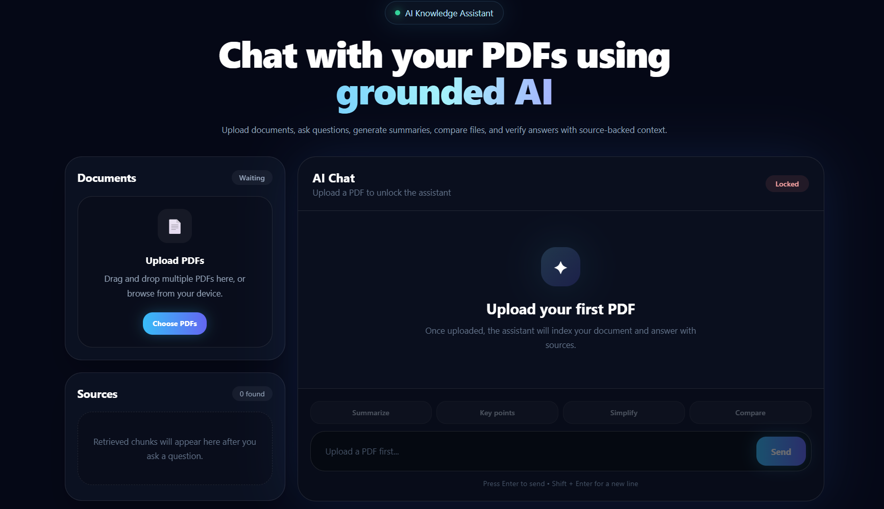
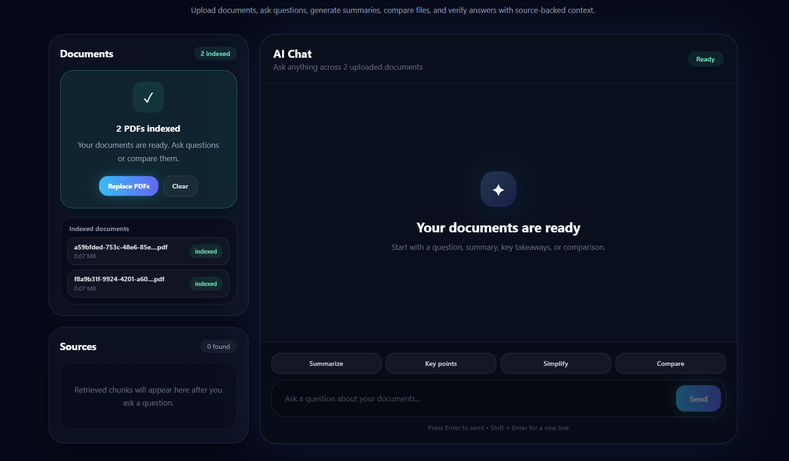
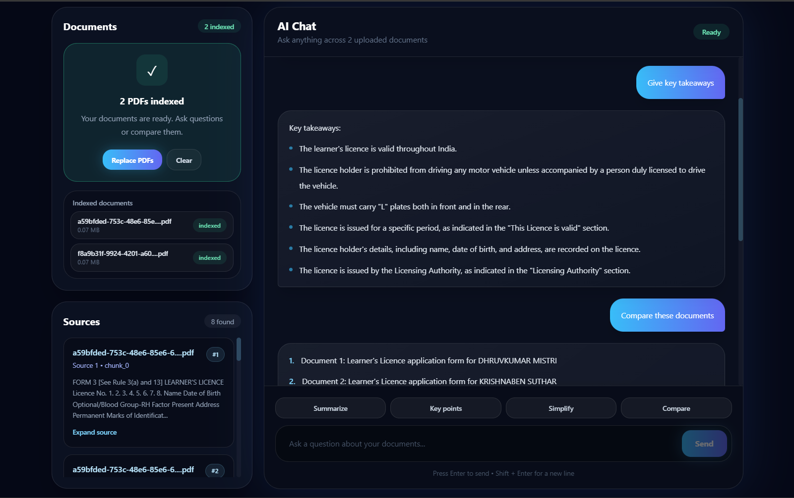

# 🧠 Multi-Document RAG AI Assistant

> Ask questions, compare documents, and get grounded answers from your PDFs using AI.

A full-stack AI-powered web application that allows users to upload multiple PDFs, ask questions, compare documents, and receive accurate, source-backed answers using Retrieval-Augmented Generation (RAG).

Built from scratch using modern AI architecture, vector search, and a premium UI to simulate real-world knowledge assistant systems.

---

## 🌐 Live Demo

🔗 Frontend:  
https://multi-doc-rag-assistant.vercel.app/

🔗 Backend API:  
(https://multi-doc-rag-assistant.onrender.com/)

---

## ✨ Features

- 📄 Upload multiple PDF documents
- 🤖 AI-powered document understanding
- 🔍 Semantic search using FAISS vector database
- 💬 Chat with your documents
- 🔗 Source-backed answers with chunk preview
- 🧠 Follow-up questions (chat memory)
- ⚖️ Document comparison support
- 📊 Relevance scoring for sources
- ⚡ Fast responses with optimized embeddings
- 🎨 Modern dark UI with premium design

---

## 🛠️ Tech Stack

Frontend: React (Vite), Tailwind CSS, React Dropzone, Axios  
Backend: FastAPI, FAISS, Sentence Transformers, Groq API, PyMuPDF

Architecture: RAG Pipeline (Embedding → Retrieval → LLM Generation)

---

## 📸 Screenshots

### 🏠 Home Page

### 📄 Document Upload & Indexing

### 💬 Chat, Comparison & Source Answers

---

## ⚙️ Installation & Setup

Clone repository:

git clone https://github.com/Dhruv-0612/multi-doc-rag-assistant.git  
cd multi-doc-rag-assistant

Run frontend:

cd frontend  
npm install  
npm run dev

Frontend: http://localhost:5173

Run backend:

cd backend  
python -m venv venv  
venv\Scripts\activate  
pip install -r requirements.txt

Create backend/.env and add:

GROQ_API_KEY=your_api_key  
GROQ_MODEL=your_model

DATA_DIR=data  
UPLOAD_DIR=uploads  
FAISS_INDEX_PATH=data/faiss_index.index  
METADATA_PATH=data/chunk_metadata.json

Run backend:

uvicorn app.main:app --reload

Backend: http://127.0.0.1:8000

---

## 🧠 How It Works

User uploads PDFs → text extracted → split into chunks → embeddings generated → stored in FAISS → query converted to embedding → relevant chunks retrieved → sent to LLM → answer generated with sources.

---

## ⚠️ Limitations

- Only text-based PDFs supported
- Knowledge base resets on new upload
- No persistent storage
- No authentication

---

## 📈 Future Improvements

- Persistent vector database (avoid reset on new upload)
- Streaming responses for real-time chat experience
- PDF preview directly inside UI
- User authentication and session-based chat history
- Support for scanned PDFs using OCR
- Deployment optimization with cloud storage (S3 / GCS)

---

## 👨‍💻 Author

Dhruv Hiteshbhai Mistry
📍 India  
🔗 https://github.com/Dhruv-0612
